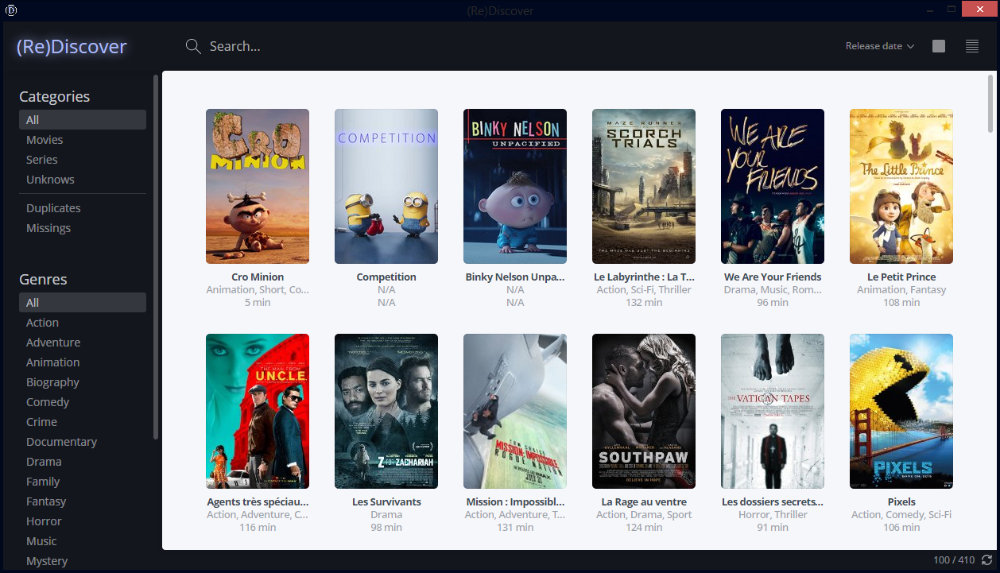

## (Re)Discover
**(Re)Discover** is a local movie indexer build on [NW.js](http://nwjs.io/).
Fast, simple and easy to use: another intuitive way to discover or rediscover movies.




### Features

* `TODO`

### Downloads - [Changelog](https://github.com/yboyer/re-discover/releases/)

[Download](https://github.com/yboyer/re-discover/releases/latest) the app, unzip, and move it to the applications folder.

- `2016-03-23` [`v1.2.0`](https://github.com/yboyer/re-discover/releases/tag/v1.2.0)
- `2016-03-19` [`v1.1.0`](https://github.com/yboyer/re-discover/releases/tag/v1.1.0)
- `2016-03-17` [`v1.0.0`](https://github.com/yboyer/re-discover/releases/tag/v1.0.0)
- `2016-01-13` [`v0.4.1`](https://github.com/yboyer/re-discover/releases/tag/v0.4.1)
- `2016-01-13` [`v0.4.0`](https://github.com/yboyer/re-discover/releases/tag/v0.4.0)
- `2016-01-10` [`v0.3.1`](https://github.com/yboyer/re-discover/releases/tag/v0.3.1)
- `2016-01-10` [`v0.3.0`](https://github.com/yboyer/re-discover/releases/tag/v0.3.0)


---

### Installation
###### Download

```bash
git clone https://github.com/yboyer/re-discover.git && cd re-dicover
```

###### Install dependencies & run

```bash
npm i
npm start
```

###### Package

```bash
npm run package
```


### Tests

```js
TODO
```

## Contributing

See [Contributing Guide](CONTRIBUTING.md).

## License

[MIT](LICENCE)
